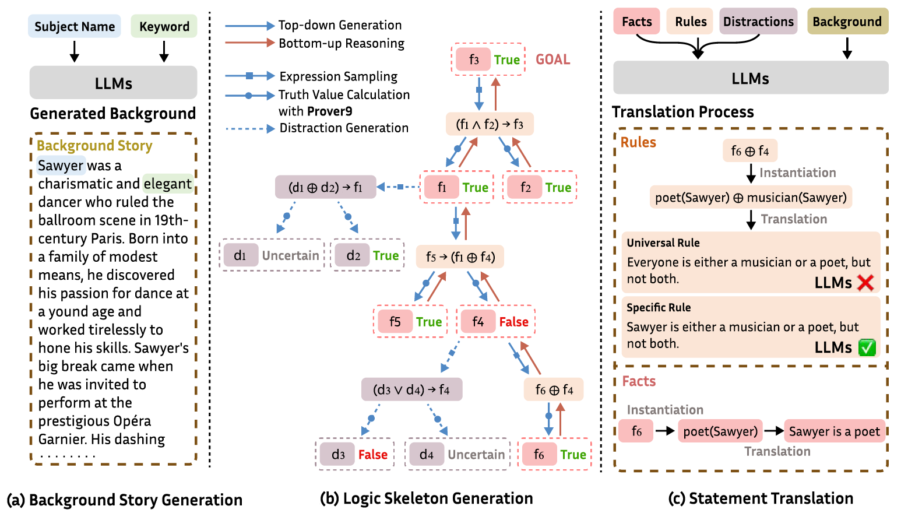

<div align="center">
<!--  -->
<!-- <h2 align="center"> $\LARGE\textbf{\textsf{{\color[rgb]{1.0, 0.7, 0.0}L}{\color[rgb]{1.0, 0.6, 0.0}O}{\color[rgb]{1.0, 0.5, 0.0}K}{\color[rgb]{1.0, 0.4, 0.0}I}}}{\color[rgb]{0,0,0}}$ 
 A Comprehensive Synthetic Data Detection Benchmark using Large Multimodal Models</h2> -->
 <h2 align="center">Large Language Models Meet Symbolic Provers for Logical Reasoning Evaluation</h2>

<a href="https://arxiv.org/abs/2502.06563" target="_blank"></a>
<a href="https://github.com/opendatalab/ProverGen" target="_blank"></a>
<a href='https://opendatalab.com/maren/ProverQA'></a>
<a href='https://huggingface.co/datasets/opendatalab/ProverQA'></a>
</div>

# ProverGen

<div style="text-align: center;">
    
</div>

## Table of Contents

- [ProverGen](#provergen)
  - [Table of Contents](#table-of-contents)
  - [Installation](#installation)
    - [Install all the required packages:](#install-all-the-required-packages)
    - [Install Prover9](#install-prover9)
  - [Generation](#generation)
    - [Logic Skeleton Generation 🧭](#logic-skeleton-generation-)
    - [Logic Skeleton Translation 📝](#logic-skeleton-translation-)
    - [FOL Problem Generation 📚](#fol-problem-generation-)
  - [Evaluation ⚖️](#evaluation-️)
  - [The Performance of Reasoning Models](#the-performance-of-reasoning-models)
  - [Citation](#citation)


## Installation

### Install all the required packages:
```bash
conda create -n provergen
conda activate provergen
git clone https://github.com/opendatalab/ProverGen
cd ./ProverGen
pip install -r requirements.txt
```

### Install Prover9
The ProverGen framework leverages [Prover9](https://www.cs.unm.edu/~mccune/mace4/) for logic skeleton generation. You can download it from their [website](https://www.cs.unm.edu/~mccune/mace4/download/) (select `LADR-2009-11A.tar.gz` and download). For installation instructions, refer to the [guide](https://www.cs.unm.edu/~mccune/mace4/manual/2009-11A/).

⚠️ **Note**

**Install on Linux systems:** Since the Prover9 program is a bit outdated, you might encounter issues when running `make all`. To resolve this, navigate to `LADR-2009-11A/provers.src/Makefile` and move all `-lm` to the end of the line. This solution was found in [this StackOverflow thread](https://stackoverflow.com/questions/70388065/make-all-command-returns-error-when-installing-prover9). Here's an example:

```makefile
# original line
$(CC) $(CFLAGS) -lm -o newsax newsax.o $(OBJECTS) ../ladr/libladr.a

# modified line
$(CC) $(CFLAGS) -o newsax newsax.o $(OBJECTS) ../ladr/libladr.a -lm
```
**Install on MacOS:** When installing Prover9 on macOS, you might encounter errors like `error: parameter 'max_constrained' was not declared, defaults to 'int'; ISO C99 and later do not support implicit int [-Wimplicit-int]` —to fix this, navigate to `LADR-2009-11A/mace4.src/select.c: line 236` and add int before `min_id`, `max_id`, and `max_constrained`, then go to `LADR-2009-11A/mace4.src/msearch.c: line 850` and change `int next_domain_size(n)` to `int next_domain_size(int n)`. Below is an example:

```c
// LADR-2009-11A/mace4.src/select.c: line 236
// original line
int select_concentric_band(min_id, max_id, max_constrained)
// modified line
int select_concentric_band(int min_id, int max_id, int max_constrained)

// LADR-2009-11A/mace4.src/msearch.c: line 850
// original line
int next_domain_size(n)
// modified line
int next_domain_size(int n)
```

After successfully installing Prover9, update the binary locations in `logic_skeleton_generator.py` at line 20. 

## Generation

The generation process is divided into three key steps: Logic Skeleton Generation 🧭, Logic Skeleton Translation 📝, and FOL Problem Generation 📒.

### Logic Skeleton Generation 🧭

To generate logic skeletons, please run the `logic_skeleton_generator.py` script with the following parameters:

- `num`: Number of logic skeletons to generate.
- `mode`: Difficulty level (easy, medium, or hard).
- `output_dir`: Directory to save the output file.

The script also allows customization of the distribution of answers ([True, False, Uncertain]) and the proportion of composite conclusions. 

<details><summary>Here are the relevant parameters:</summary><p>

- `goal_value_probs`: Distribution of [True, False, Uncertain] (e.g., [0.4, 0.3, 0.3]).
- `rule_candidate_path`: Path to the rule pool file.
- `rule_as_goal_proportion`: Proportion of fact vs. rule conclusions (e.g., [0.7, 0.3]).
- `fact_num_threshold`: If the fact pool size surpasses this threshold, there's a chance the fact will be provided directly.
- `fact_num_prob`: Probability of directly providing a fact.
</p></details>


**Example Command** 👇:
```bash
python3 logic_skeleton_generator.py --mode easy --num 500 --output_dir outputs/logic_data
```

### Logic Skeleton Translation 📝

Once the logic skeletons are generated, execute `logic_skeleton_translator.py` to convert the logic expressions into natural language. The translation process is controlled by eight parameters:

- `num`: Total number of logic skeletons in the file.
- `mode`: Type of logic skeletons (`easy`, `medium`, or `hard`). Together with `num`, this identifies the logic skeleton file.
- `start`: Starting index of the problem.
- `end`: Ending index of the problem.
- `data_dir`: Directory containing the logic skeleton file.
- `output_dir`: Directory to store the output file.
- `model_name`: LLM used for translation.

For local models, configure these additional parameters:
- `base_url`: Base URL of the local LLM service.
- `api_key`: API key for the local LLM service. 

**Example Command** 👇:
```bash
python3 logic_skeleton_translator.py --num 100 --mode hard --start 0 --end 0 --data_dir outputs/logic_data --output_dir outputs/translated_data --model_name meta-llama/Meta-Llama-3.1-70B-Instruct --base_url localhost:6417 --api_key EMPTY
```

### FOL Problem Generation 📚

In the final step, problems are generated using the translated facts, rules, and distractions. This step also supports data augmentation techniques, such as breaking down problems into smaller steps or paraphrasing sentences to create new problem variations. The generation process is controlled by the following parameters:

- `start`: Starting index of the problem.
- `end`: Ending index of the problem.
- `mode`: Generation mode (`normal_generation`, `step_augment`, `uncertain_augment`).
- `filepath`: Path to the translated files.
- `output_dir`: Output directory for the generated files.
- `model_name`: Model used for generation.

For local LLM, configure these additional parameters:
- `base_url`: Base URL of the local LLM service.
- `api_key`: API key for the local LLM service.

Distraction control parameters:
- `noise1`: Type I distraction (`1` to include, `0` to exclude).
- `noise2`: Type II distraction (`1` to include, `0` to exclude).

**Example Command** 👇:
```bash
python3 fol_problem_generator.py --start 0 --end 100 --mode normal_generation --filepath outputs/translated_data/hard-100-0_100.json --output_dir outputs/final_data --model_name meta-llama/Meta-Llama-3.1-70B-Instruct --base_url localhost:6417 --api_key EMPTY
```

## Evaluation ⚖️

To assess the performance of LLMs on ProverGen, run `evaluation.py` with the following parameters:

- `model_name`: The models to evaluate.
- `base_url`: The base URL of the local LLM service. (Optional for GPT or Claude.)
- `api_key`: The API key for the local LLM service. (Optional for GPT or Claude.)
- `dataset_name`: The dataset name (`ProverGen`, `FOLIO`, `ProntoQA`, `ProofWriter`).
- `split`: The subset of the dataset. Use `dev` for `FOLIO`, `ProntoQA`, and `ProofWriter`. For `ProverGen`, choose from `easy`, `medium`, or `hard`.
- `mode`: The evaluation mode (`Direct` or `CoT`).
- `output_dir`: The directory for the output file.
- `start`: The starting index of the problem.
- `end`: The ending index of the problem.
- `trained_model`: Include this parameter if evaluating a fine-tuned model.

**Example Command** 👇:
```bash
python3 evaluation.py --model_name meta-llama/Meta-Llama-3.1-70B-Instruct --base_url http://localhost:6417/v1 --api_key EMPTY --dataset_name ProverGen --split easy --mode Direct --output_dir result/ --start 0 --end 600
```

After running the evaluation script, compute the metrics📊 by executing `metric.py` on the generated result file. 

## The Performance of Reasoning Models
In addition to the data presented in the paper, we further evaluate the performance of two reasoning models (**OpenAI-O1** and **DeepSeek-R1**) under a **zero-shot setting**. Their performance is summarized below: 📊✨

|Model Name|ProverQA-Easy|ProverQA-Medium|ProverQA-Hard|
| -----------------------| -------| --------| -------|
|GPT-4o CoT|94.20|79.40|50.00|
|Claude-3.5-Sonnet CoT|95.20|83.60|56.40|
|o1-preview-2024-09-12|89.80|78.80|66.20|
|DeepSeek-R1|91.80|78.40|66.60|

## Citation
Please cite the following paper if you find our code or data helpful.
```
@inproceedings{
qi2025large,
title={Large Language Models Meet Symbolic Provers for Logical Reasoning Evaluation},
author={Chengwen Qi and Ren Ma and Bowen Li and He Du and Binyuan Hui and Jinwang Wu and Yuanjun Laili and Conghui He},
booktitle={The Thirteenth International Conference on Learning Representations},
year={2025},
url={https://openreview.net/forum?id=C25SgeXWjE}
}
```
